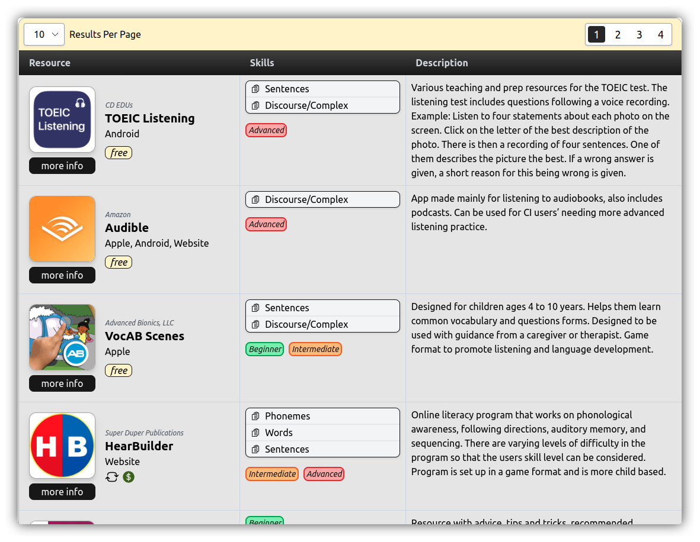

# Auditory Training Resources

  

## Purpose
There are many auditory training resources that often have unique requirements. A patient may require an Android application, or help with a specific skill. The patient may also already be at a specific skill level, and want a resource that is more challenging or easier depending on age group. The goal of this application is to provide an accessible website for patients and providers to easily find recommendations for auditory training development resources based on their unique requirements.

## Production Deployment
TODO

## Local Deployment
TODO

## API Access
Documentation and updates to our RPC backend API are planned for the future. As of now there is no official documentation for accessing our resources database. More information to come!
